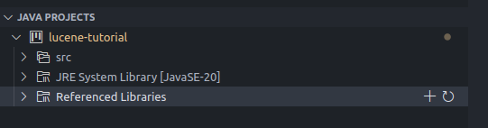

# Lucene Tutorial: Getting Started

The code is an updated version version of the [Tutorialspoint article](https://www.tutorialspoint.com/lucene/lucene_first_application.htm). The one linked in the article is outdated, as it uses lucene 3.6.2, which is not available anymore. The code in this repository uses lucene 9.9.2, so I have made the necessary changes to make it work with the latest version of lucene.

## Installtion and setup

1. Install JAVA and make sure it is in your PATH. If you are unsure about choosing which JAVA version, OpenJDK, Amazon Corretto or Oracle SE all are good options. While testing is this worked properly I used [Oracle SE 20](https://www.oracle.com/java/technologies/javase/jdk20-archive-downloads.html).

2. Download the 9.9.2 version of [Lucene](https://archive.apache.org/dist/lucene/java/9.9.2/lucene-9.9.2-src.tgz). Extract the downloaded file to a location of your choice.

3. Install the recommended JAVA extension pack for VSCode.

4. Create a new Java project in VSCode (if you prefer a different IDE, you obviously can use that, it's just that I only use VSCode so instructions listed will be for that).

5. Add all the jar files from the the modules folder in your extracted lucene folder to referenced libraries in your project.

### Testing

1. Initially run the `LuceneTester.java` file. If everything is set up properly, it should index the files and search for files containing the word "Ben Stiller".

2. Make any changes as per the [documentation](https://lucene.apache.org/core/9_9_2/core/index.html) and test them out similarly. If you have any doubts feel free to reach out to me. As long as it is not directly an answer to the assignment (after the assignment is out), I will be happy to help.
